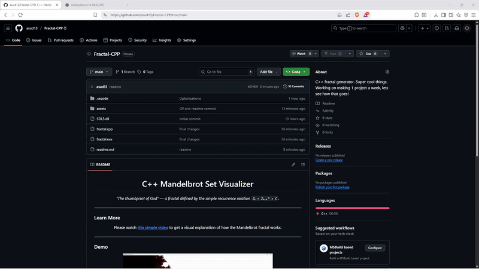

<h1 align="center"> C++ Mandelbrot Set Visualizer</h1>

  <em>"The thumbprint of God" — a fractal defined by the simple recurrence relation <code>Zₙ = Zₙ₋₁² + C</code>.</em>

---

### Learn More

  Please watch 
  <a href="https://www.youtube.com/watch?v=2JUAojvFpCo" target="_blank"><b>this simple video</b></a> 
  to get a visual explanation of how the Mandelbrot fractal works.

---

### Demo
You scroll up and down to zoom in and out. 

The position of your mouse is what is being zoomed in to / out of. 

If you want to explore another part of this fractal, simply move your mouse to that part of the fractal. 

Below is how this program looks like. 

  

---

### About this Project
This project generates and visualizes the **Mandelbrot set** using C++.  
It demonstrates complex number iteration and graphical rendering of fractal boundaries.

Key concepts:
- Complex arithmetic  
- Escape-time algorithm  
- Zoom visualization  

---

### Installation instructions 
There is no need to git clone this project, as there is already a .exe provided. 

You simply need to put the file **Fractal.exe** in the same folder as **SDL3.dll**. 

Demonstration here: 

  

There will be a lot of download and windows flags, just ignore those, as shown in the video. 

---
### What I did 

I used SDL3 as a way to graphically represent this fractal. 

Each pixel on the screen corresponds to a point on the complex plane. 

By iterating this formula many times and mapping distance to escape to different colors, we can create the mesmerizing patterns of the mandelbrot set. 

---
### Multithreading 

- Rendering a Mandelbrot fractal uses millions of pixel computations, therefore I used **parallelization** to make this fractal efficient. 
- Threads run concurrently 
- Once finished, they update pixel buffer and then prompt SDL3 to display these pixels. 

---
### Other Optimizations 
- Early escape checks where we terminate iteration immediately upon divergence, rather than letting unchecked loop run. 
- Loop unrolling to minimize branching 
- Frame caching to minimize redraws by only updating upon zoom. 

  Built with C++ and ❤️

